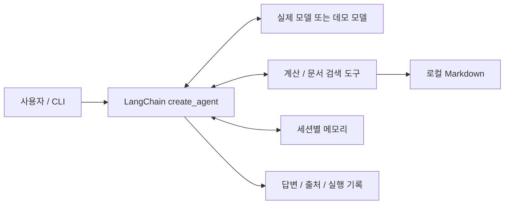

# LangChain 업무 지원 Agent

## 목적과 설계

사용자의 요청에 따라 사내 Markdown 문서를 검색하고 수식을 계산하는 실행 가능한 Agent입니다.
LangChain `create_agent`가 모델 호출 → 도구 실행 → 결과 관찰 → 추가 도구 호출 또는 최종 답변을 관리합니다.
공식 API: https://docs.langchain.com/oss/python/langchain/agents



- `agent_langchain/runtime.py`: 모델 구성, 시스템 지침, 실행 제한, 세션 기억, 결과 정리
- `agent_langchain/tools.py`: 수식 계산, 출처가 포함된 키워드 검색
- `agent_langchain/demo.py`: API 없이 재현 가능한 규칙 기반 테스트 모델
- `agent_langchain/cli.py`: 단일 요청 및 대화형 실행

기존 Native Agent의 HTTP API와 웹 화면은 기존 런타임을 사용합니다. 새 LangChain 모드는 별도 CLI입니다.
LangChain 모드에는 읽기 도구만 연결되어 있으며 기존 할 일 생성·쓰기 승인 기능은 Native 모드에 있습니다.

## 설치

저장소 루트에서 Python 3.11 이상으로 실행합니다.

```bash
python3 -m venv .venv
source .venv/bin/activate
python -m pip install -e '.[langchain]'
```

## API 키 없는 실행

```bash
python -m agent_langchain '휴가 정책을 찾고 128 * 42를 계산해줘' --json
```

`5376`과 휴가 정책, `[employee-handbook.md]` 문서 파일명 출처가 출력됩니다.
`trace`에는 도구 이름·입력·결과가 포함됩니다. 데모 모델은 일반적인 자연어 추론을 하지 않지만
실제 LangChain 그래프에서 두 도구를 실행하고 관찰 결과를 답변으로 반환합니다.

## 실제 LLM으로 실행

```bash
export OPENAI_API_KEY='사용자의 API 키'
export OPENAI_MODEL='gpt-5.4-mini'
python -m agent_langchain --provider openai '휴가 정책을 찾아 요약하고, 128명에게 42개씩 지급할 때 총수량을 계산해줘' --json
```

`--model`로 계정에서 사용 가능한 도구 호출 지원 모델을 지정할 수 있습니다.
실제 모델 사용 시 사용자 메시지와 검색된 문서 일부가 모델 공급자에게 전달됩니다.
공개 가능한 예제 문서로 시작하세요. `.env`는 자동 로드하지 않으므로 위처럼 환경 변수를 설정합니다.
모델 요청 시간 제한은 60초, 재시도는 최대 2회입니다. 재시도를 포함한 전체 실행 시간은 더 길 수 있습니다.

## 대화와 문서 교체

```bash
python -m agent_langchain --provider openai --session work
python -m agent_langchain --knowledge-dir ./knowledge '보안 정책을 찾아줘'
```

메시지를 생략하면 대화 모드이며 `/exit`로 종료합니다. 세션 기억은 프로세스 안에서만 유지됩니다.
새 프로세스에서 같은 세션 이름을 사용해도 이전 대화가 복원되지는 않습니다.
문서는 지정 폴더의 최상위 `.md` 파일을 대상으로 검색합니다. 최대 100개, 파일당 1MB,
상위 3개 문단을 반환합니다. 벡터 검색이 아닌 키워드 검색이므로 동의어·의미 검색에는 한계가 있습니다.

`--max-steps 12`는 모델·도구 그래프 단계의 상한이며 도구 호출 수와 동일하지 않습니다.
수식은 길이를 제한하며 임의 코드 실행과 거듭제곱을 허용하지 않습니다.
문서의 지시를 따르지 않도록 시스템 지침에 명시했지만 이것만으로 프롬프트 인젝션을 완전히 방어하지는 않습니다.

## 검증

```bash
python -m unittest discover -s tests -v
python -m agent_native.evaluation
```

통합 테스트는 실제 LangChain 그래프와 로컬 테스트 모델을 사용하여 복합 도구 실행, 오류 관찰,
출처 반환, 세션 분리, 무한 반복 제한을 검증합니다. 외부 API 호출은 하지 않습니다.
의존성이 없으면 LangChain 테스트는 건너뛰므로 설치 후 실행하여 확인하세요.

### 확인한 실행 결과

- Python 3.14.6, LangChain 1.4.0, LangGraph 1.2.11, langchain-openai 1.6.2 환경에서 검증
- 테스트 15개 통과(새 LangChain 통합 테스트 9개 + 기존 테스트 6개)
- 기존 Native Agent 평가 3/3 통과
- 복합 요청 CLI에서 계산 결과 `5376`, 휴가 정책 및 `employee-handbook.md` 출처 확인
- 외부 LLM 호출은 API 키가 없는 환경이므로 미검증
