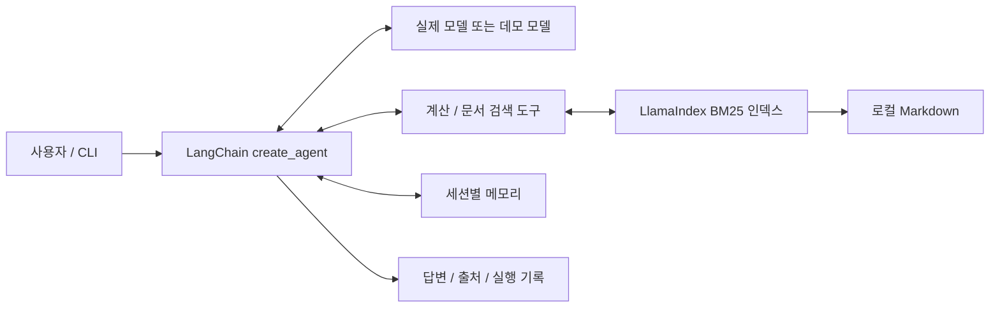

# LangChain + LlamaIndex 업무 지원 Agent

## 목적과 설계

사용자의 요청에 따라 사내 Markdown 문서를 검색하고 수식을 계산하는 실행 가능한 Agent입니다.
LlamaIndex `MarkdownNodeParser`와 `BM25Retriever`가 문서 분할·인덱싱·검색을 담당합니다.
LangChain `create_agent`가 모델 호출 → 도구 실행 → 결과 관찰 → 추가 도구 호출 또는 최종 답변을 관리합니다.
공식 API: https://docs.langchain.com/oss/python/langchain/agents



- `agent_langchain/runtime.py`: 모델 구성, 시스템 지침, 실행 제한, 세션 기억, 결과 정리
- `agent_langchain/tools.py`: 수식 계산, LlamaIndex 검색 도구 연결
- `agent_langchain/knowledge.py`: Markdown 분할, BM25 인덱싱, 변경 감지, 출처·점수·노드 ID 반환
- `agent_langchain/demo.py`: API 없이 재현 가능한 규칙 기반 테스트 모델
- `agent_langchain/cli.py`: 단일 요청 및 대화형 실행

웹 화면은 승인·영속 메모리·추적을 제공하는 Native 런타임을 사용합니다.
Ollama 모드에서는 LangChain ChatOllama 모델 어댑터와 LlamaIndex 검색을 연결합니다.
별도 LangChain CLI는 `create_agent`가 도구 실행 루프를 관리합니다.
LangChain 모드에는 읽기 도구만 연결되어 있으며 기존 할 일 생성·쓰기 승인 기능은 Native 모드에 있습니다.

## 설치

저장소 루트에서 Python 3.11 이상으로 실행합니다.

```bash
python3 -m venv .venv
source .venv/bin/activate
python -m pip install -e '.[langchain]'
```

## API 키 없는 실행

```bash
python -m agent_langchain '휴가 정책을 찾고 128 * 42를 계산해줘' --json
```

`5376`과 휴가 정책, `[employee-handbook.md]` 문서 파일명 출처가 출력됩니다.
`trace`에는 도구 이름·입력·결과가 포함됩니다. 데모 모델은 일반적인 자연어 추론을 하지 않지만
실제 LangChain 그래프에서 두 도구를 실행하고 관찰 결과를 답변으로 반환합니다.

## 실제 LLM으로 실행

```bash
export OPENAI_API_KEY='사용자의 API 키'
export OPENAI_MODEL='gpt-5.4-mini'
python -m agent_langchain --provider openai '휴가 정책을 찾아 요약하고, 128명에게 42개씩 지급할 때 총수량을 계산해줘' --json
```

`--model`로 계정에서 사용 가능한 도구 호출 지원 모델을 지정할 수 있습니다.
실제 모델 사용 시 사용자 메시지와 검색된 문서 일부가 모델 공급자에게 전달됩니다.
공개 가능한 예제 문서로 시작하세요. `.env`는 자동 로드하지 않으므로 위처럼 환경 변수를 설정합니다.
모델 요청 시간 제한은 60초, 재시도는 최대 2회입니다. 재시도를 포함한 전체 실행 시간은 더 길 수 있습니다.

## 대화와 문서 교체

```bash
python -m agent_langchain --provider openai --session work
python -m agent_langchain --knowledge-dir ./knowledge '보안 정책을 찾아줘'
```

메시지를 생략하면 대화 모드이며 `/exit`로 종료합니다. 세션 기억은 프로세스 안에서만 유지됩니다.
새 프로세스에서 같은 세션 이름을 사용해도 이전 대화가 복원되지는 않습니다.
문서는 지정 폴더의 최상위 `.md` 파일을 대상으로 검색합니다. 최대 100개, 파일당 1MB,
총 5MB, 최대 4000개 청크를 인덱싱하고 상위 3개 결과를 반환합니다.
LlamaIndex의 실제 BM25 검색이며 임베딩 모델을 사용한 의미 검색은 아닙니다.
한국어를 포함한 Unicode 단어를 사용하고 영어 어간 처리는 끕니다. 한국어 형태소 분석은 하지 않으므로
`휴가`, `보안`처럼 핵심 명사로 검색하는 것이 좋습니다. 동의어·조사 변형 검색에는 한계가 있습니다.
검색 시 파일 내용 해시를 비교하여 추가·수정·삭제를 자동 반영합니다. 인덱스는 메모리에 캐시하며
프로세스를 다시 시작하면 재구축합니다. 검색 결과에는 `engine: llamaindex-bm25`, 점수와 노드 ID가 포함됩니다.
공식 검색 API: https://developers.llamaindex.ai/python/framework/integrations/retrievers/bm25_retriever/

`--max-steps 12`는 모델·도구 그래프 단계의 상한이며 도구 호출 수와 동일하지 않습니다.
수식은 길이를 제한하며 임의 코드 실행과 거듭제곱을 허용하지 않습니다.
문서의 지시를 따르지 않도록 시스템 지침에 명시했지만 이것만으로 프롬프트 인젝션을 완전히 방어하지는 않습니다.

## 검증

```bash
python -m unittest discover -s tests -v
python -m agent_native.evaluation
```

통합 테스트는 실제 LangChain 그래프와 로컬 테스트 모델을 사용하여 복합 도구 실행, 오류 관찰,
출처 반환, 세션 분리, 무한 반복 제한을 검증합니다. 외부 API 호출은 하지 않습니다.
의존성이 없으면 LangChain 테스트는 건너뛰므로 설치 후 실행하여 확인하세요.

### 확인한 실행 결과

- Python 3.14.6, LangChain 1.4.0, LangGraph 1.2.11, langchain-openai 1.6.2 환경에서 검증
- 테스트 21개 통과(LangChain·LlamaIndex·Ollama 어댑터 테스트 15개 + 기존 테스트 6개)
- 기존 Native Agent 평가 3/3 통과
- 복합 요청 CLI에서 계산 결과 `5376`, 휴가 정책 및 `employee-handbook.md` 출처 확인
- LlamaIndex core 0.14.24, BM25 retriever 0.6.5 환경에서 검색 순위·문서 변경·삭제·빈 문서 검증
- OpenAI 호출은 API 키가 없는 환경이므로 미검증
- 실제 로컬 LLM `qwen3:latest`로 6/6 평가 통과: 계산·추적, 검색·출처, 영속 메모리 회상, 승인 후 생성, 거절, LangChain 복합 요청


## Ollama로 화면에서 사용하기

설치된 도구 호출 지원 모델을 사용합니다. 이 환경에서는 `qwen3:latest`로 검증했습니다.
Ollama 서버가 실행 중이어야 합니다. 기본 주소는 `http://127.0.0.1:11434`입니다.

```bash
python -m pip install -e '.[langchain]'
export AGENT_PROVIDER=ollama
export OLLAMA_MODEL=qwen3:latest
export AGENT_PORT=8091
python -m agent_native
```

`http://127.0.0.1:8091`에서 Operations Copilot을 엽니다. 헤더에 실제 공급자와 모델이 표시됩니다.
계산, 정책 검색, 이름 기억, 승인형 할 일 생성을 사용할 수 있습니다. 현재 할 일은 외부 업무 서비스가
아닌 로컬 JSON 목록에 저장됩니다. 사용자 메모와 세션, 승인, 실행 기록도 로컬 JSON에 저장됩니다.
웹 런타임은 한 모델 응답당 도구 하나를 처리합니다. 모델이 여러 도구를 동시에 반환하면
일부만 실행하지 않고 오류로 종료합니다. 독립된 작업을 하나씩 요청하세요.

별도 LangChain CLI에서는 복합 도구 호출도 가능합니다.

```bash
python -m agent_langchain --provider ollama '휴가 정책을 찾고 128 * 42를 계산해줘' --json
python -m agent_langchain.evaluate_ollama
```

실제 모델 평가는 임시 폴더에서 실행되어 사용자 할 일과 메모리를 변경하지 않습니다.
모델 출력은 실행 환경과 버전에 따라 달라질 수 있습니다. 이번 검증 중 저장된 이름을 잘못 답한
문제를 발견하여 사용자 메모를 우선 참조하는 시스템 지침을 보강한 뒤 전체 평가를 통과했습니다.

## 화면에서 모델 선택

입력창 위의 **모델** 메뉴에서 설치된 Ollama 모델을 선택합니다. 선택은 다음 요청부터 적용되며
현재 대화와 저장된 사용자 메모는 유지됩니다. 모델 목록 새로고침으로 새로 설치한 모델을 반영합니다.
마지막 선택은 현재 브라우저에 저장되며, 삭제되었거나 사용 불가능하면 기본 모델로 돌아갑니다.

`GET /api/models`는 Ollama의 `/api/tags`와 `/api/show`로 설치 여부와 `tools` 지원을 확인합니다.
임베딩 전용·도구 호출 미지원·정보 조회 실패 모델은 선택할 수 없습니다. 목록 조회 실패 시
전송을 차단하고 재시도할 수 있도록 표시합니다. 다운로드나 모델 설치는 자동 실행하지 않습니다.

`POST /api/chat`에 `model`을 지정하면 해당 요청만 선택한 모델을 사용합니다. 실행 기록에도
모델명을 저장하며, 승인 대기 작업은 화면의 선택값과 무관하게 원래 모델로 이어집니다.
미처리 도구 호출이 있는 대화는 승인을 끝내거나 새 대화로 시작해야 합니다. 로컬 웹 런타임은
동시 실행 충돌을 막기 위해 채팅과 승인 요청을 순서대로 처리합니다.

이 선택 메뉴는 Ollama 모드의 설치 모델을 대상으로 합니다. OpenAI·데모 모드에서는 설정된
단일 모델을 표시합니다. 도구 지원 여부가 모든 요청에서의 모델 품질을 보장하지는 않습니다.
큰 모델은 더 많은 메모리와 초기 로딩 시간이 필요합니다.
